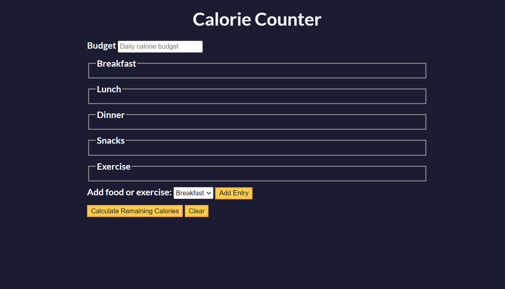

# calorieCounter

## Overview

Welcome to the Calorie Counter App! This simple web application allows you to track your daily calorie intake and monitor your budget.

## Features

- **Entry Management:**

  - Add entries for breakfast, lunch, dinner, snacks, and exercise.
  - Dynamically add multiple items for each entry type.

- **Calorie Calculation:**

  - Input the calories consumed and burned for each entry.
  - Calculate the remaining calories based on your budget.

- **Budget Tracking:**
  - Set a daily calorie budget to stay on track.
  - See the surplus or deficit in your calorie consumption.

## How to Use

1. **Set Budget:**

   - Enter your daily calorie budget in the provided input.

2. **Add Entries:**

   - Use the dropdown menu to select the type of entry (breakfast, lunch, dinner, snacks, or exercise).
   - Click the "Add Entry" button to add items for each entry.

3. **Calculate Calories:**

   - Click the "Calculate Calories" button to see your daily calorie summary.

4. **Clear Form:**
   - Click the "Clear" button to reset the form and start over.

## Technologies Used

- HTML
- JavaScript

## App

